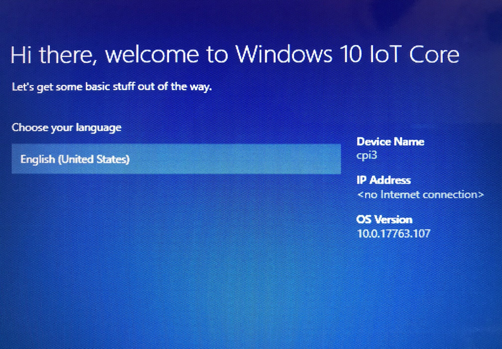
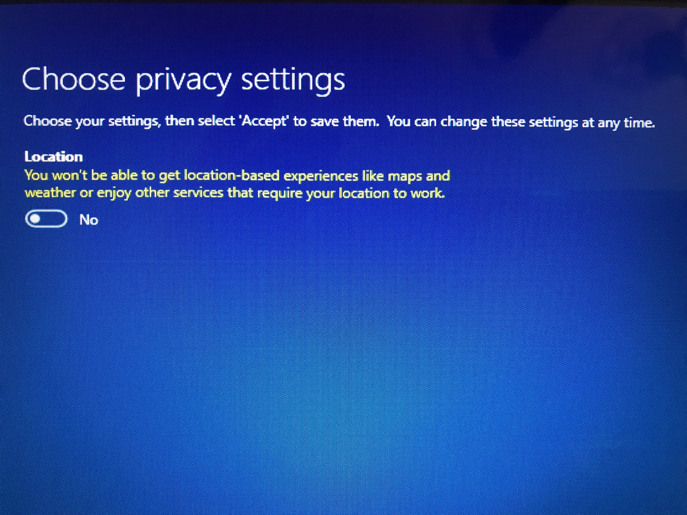
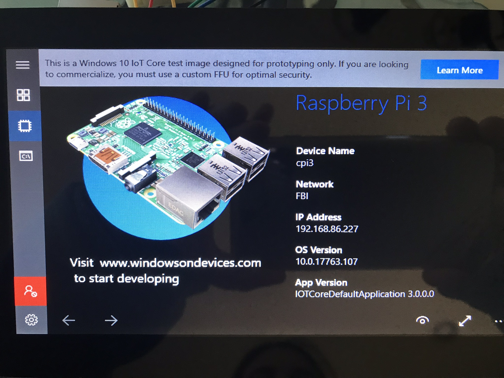

# Configuring the Device
## Booting up for the first time
Using the USB to MicroUSB cable, connect the Raspberry Pi to your computer. The Raspberry Pi is only using this cable for 5v power.

The first boot may take some time as it is performing first time setup.

## Set Language and Network connectivity options
Once the device has booted for the first time, you must select a default language. Select your language of choice, then press the **Next** button

## Optionally send analytics data to Microsoft
Windows IoT Core gives you the ability to share analytic information from the Operating System. This data allows Microsoft to improve the quality of the product. You may choose one of the options on the screen, or not choose any at all. When you've made your decision, press the **Next** button.

## Location Information
Windows IoT Core also allows location information to be shared. If you have a requirement for the device to provide location information, ensure you set this value to **Yes**, for our purposes in this lab, it is fine to leave this value as **No**.

## Network Information
If you weren't able to setup the Wi-Fi information from the dashboard, you will be able to do it at this point in the setup process. Select the network with which you'd like to connect, then enter the Wi-Fi key to make the connection.

## Completed Setup
Once the device has been setup, the default application for Windows IoT Core will display.

# Next Up
[Lab 3 - Wiring the Water Level Sensor Solution](../Lab%203%20-%20Wiring%20the%20Water%20Level%20Sensor%20Solution/index.md)

