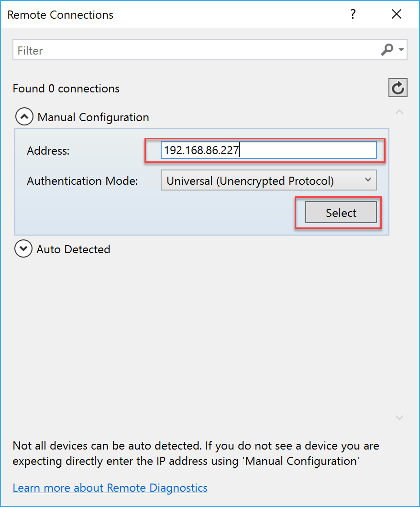
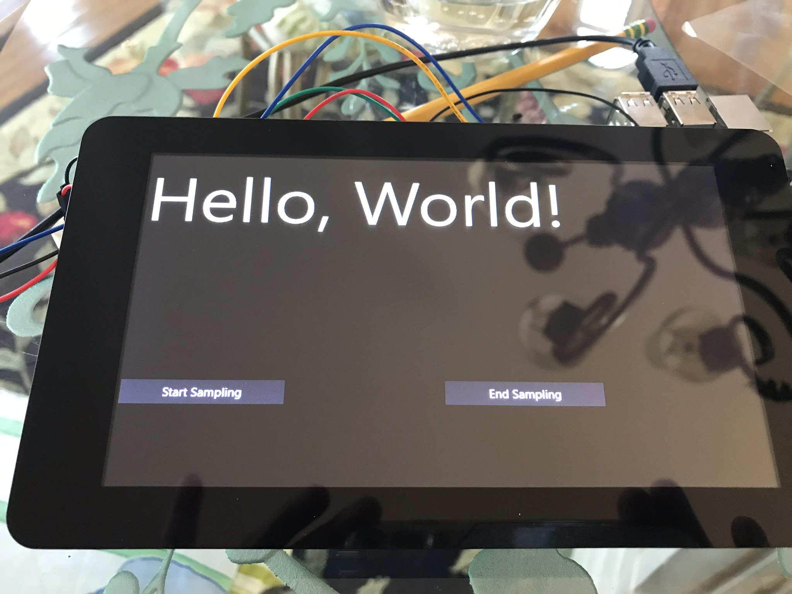
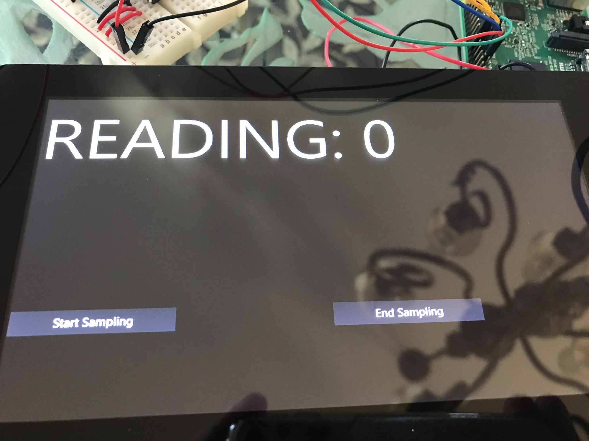

# Creating the UWP Application
Windows IoT Core running on the Raspberry Pi allows for UWP applications to run in the foreground. This allows you to implement applications such as kiosks and monitors to expose the data being collected by the device in a way that makes sense to your consumers.

# Run the application
Open the WaterLevelSensor/AnalogReader/AnalogReader.sln solution file in Visual Studio. From the Debug menu, select remote machine, and enter the IP address of the device that you'd like to deploy to. 

Ensure the build is set to Debug, and the CPU type to ARM, then Press F5 to run the application.

**Note** the first deployment of a UWP application will take a bit longer as it needs to install supporting frameworks. Subsequent deployments of applications will be quicker.

## Understanding the application

This application is already setup to read sensor data every 100 milliseconds. Press the **Start Sampling** button to begin water level readings.

Start by submerging just the tip of the sensor in water, then slowly allow it to go deeper. You will notice that the values being read will increase. 

Remove the sensor from the water and dry it off, you will see the value returns to 0

