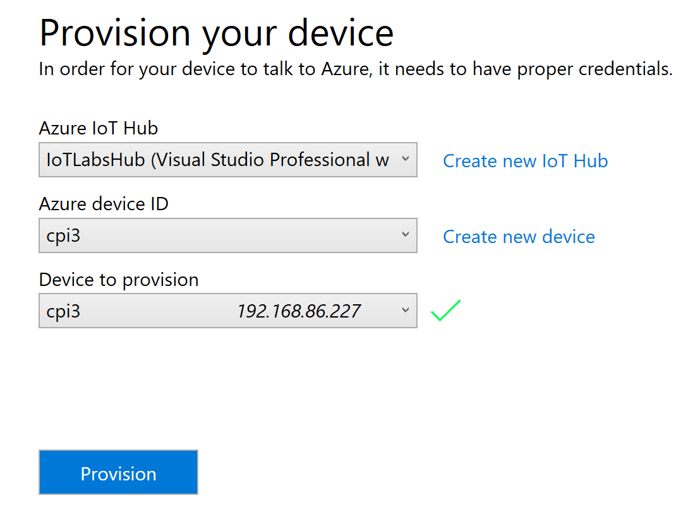

# Connecting the Pi to the IoT Hub
## Provision the Device in IoT Hub
Open the IoT Dashboard and select *Connect to Azure*. Select the IoT Hub that you created. Next to the Device ID dropdown, press the *Create new device* link. Enter a good name for the Device and select your Pi from the Device To Provision list. Press the *Provision* button to provision the device. 

## Retrieve the Device Connection String
In the Azure Portal, open the IoT Hub, then under the *Explorers* section, select *IoT Devices*, then choose the device that was just created by the IoT Dashboard tool. Copy the Primary device connection string from this details page. 

## Configure TPM Settings with the Device Connection string
Open the IoT Dashboard, on the *My Devices* section, right-click on your Pi device, and select the *Open in device portal* option. 
In the device portal, select the *TPM Configuration* menu option. From there, paste your device connection string into the Azure Connection String textbox. ![Enter Device Connection String in TPM Configuration]
Upon completion of this step, reboot your Pi using the IoT Dashboard application (My Devices -> right click on device -> Restart)

## Install the Windows Device Explorer
The Windows Device Explorer allows you to visualize data as it arrives into the IoT Hub. 
[Download and install this tool](https://aka.ms/aziotdevexp).

## Obtain connection information from the IoT Hub
In the Azure Portal - select the IoT Hub, and select *Shared Access Policies* in the Settings section. From there, select the *iothubowner* role, then copy the primary key connection string value. 

## Connect the Windows Device Explorer to the IoT Hub
Open the Windows Device Explorer application, and paste the connection string in the IoT Hub Connection String box.

