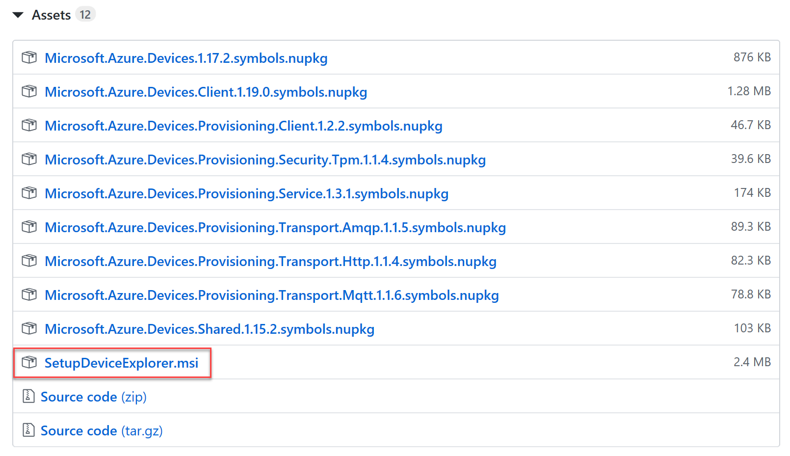
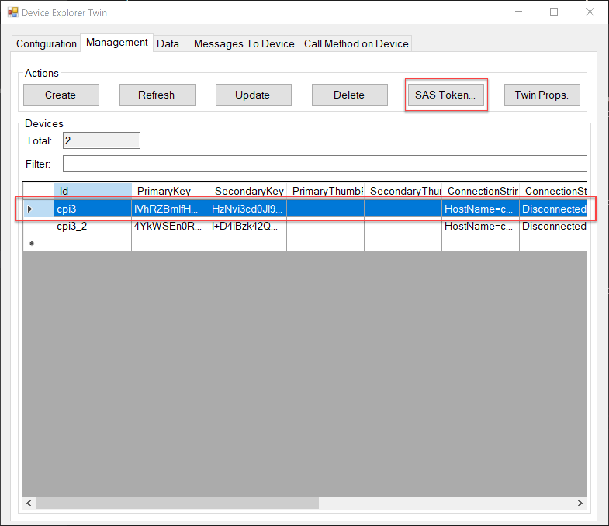
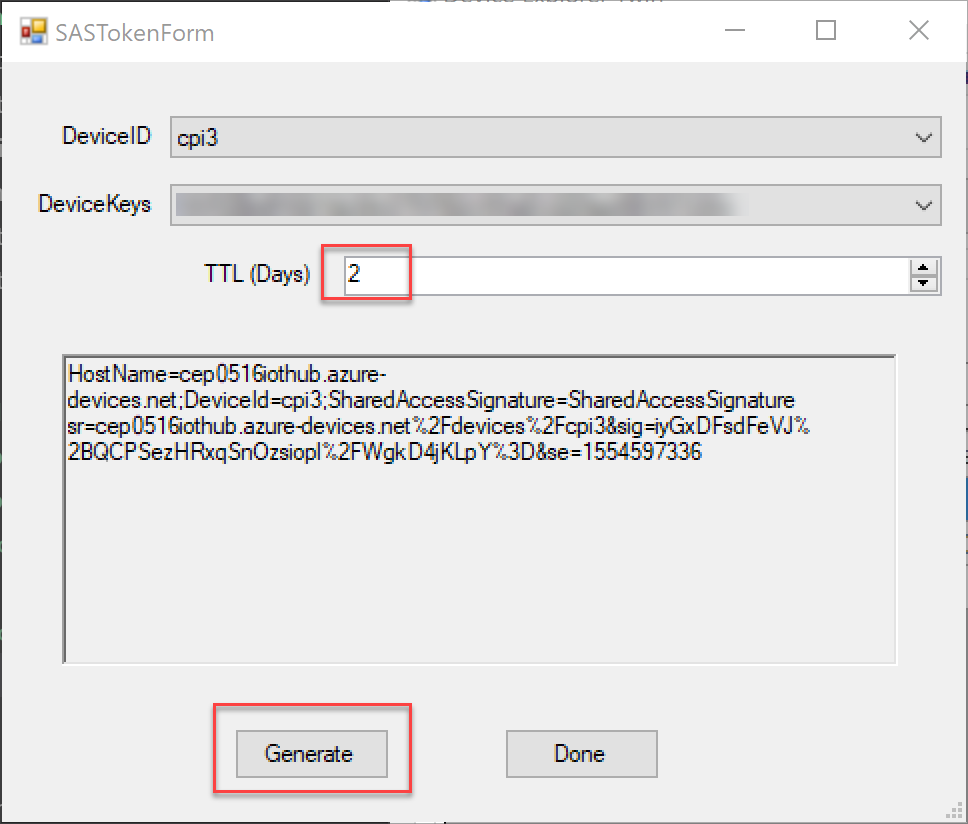
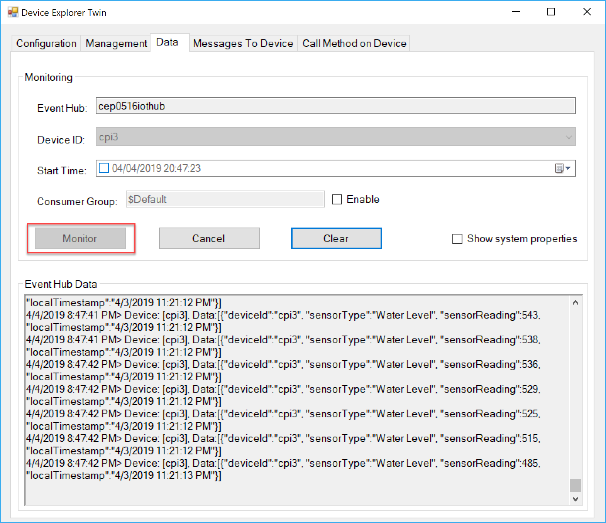

# Sending Telemetry Data to the IoT Hub

## Provision the Device in IoT Hub
Open the IoT Dashboard and select *Connect to Azure*. Select the IoT Hub that you created. Next to the Device ID dropdown, press the *Create new device* link. Enter a good name for the Device and select your Pi from the Device To Provision list. Press the *Provision* button to provision the device. 

## Install the Windows Device Explorer
The Windows Device Explorer allows you to visualize data as it arrives into the IoT Hub. 
[Download and install this tool](https://aka.ms/aziotdevexp). Near the bottom of the screen, you will find a link to the *SetupDeviceExplorer.msi* file. Use this file to install the tool.

## Obtain connection information from the IoT Hub
In the Azure Portal - select the IoT Hub, and select *Shared Access Policies* in the Settings section. From there, select the *iothubowner* role, then copy the primary key connection string value. 

## Connect the Windows Device Explorer to the IoT Hub
Open the Windows Device Explorer application, and paste the connection string in the IoT Hub Connection String box.

## Obtain the Device SAS Token
In the Windows Device Explorer, select the **Management** tab. In the grid toward the bottom of the screen, select your device, then press the **SAS Token** button.

In the SAS Token screen, ensure you select your device, and enter a value for the TTL (in days). When finished, press the **Generate** button, then copy the generated value to your clipboard.

## Configure application code with IoT Hub information
We are going to switch gears here a little bit in that the application that we will use to send information to the IoT hub will be headless. This means that there isn't a user interface, and the application is run without requiring a screen. These headless applications can be referred to as Background Tasks. In Windows IoT Core, you are able to run only one headed (UI-based) application, but can run any number of background task applications.

If you currently have a screen on your Pi, feel free to remove it now, we will not be needing it for the remainder of the labs.

Open the **/WaterLevelSensorBackground/WaterLevelSensorBackground.sln** solution file. Then open **StartupTask.cs**, paste the SAS token that you generated in the previous step into the *_deviceSasToken* variable value (line 16), then type in the name of your device in the *_deviceName* variable (line 17). The device name is only used to identify the device in the telemetry data.

## Run the application
As with the previous application, ensure the application is targeting the ARM processor, and is set to run on Remote Machine (with the IP of your pi).

Verify data is flowing to the IoT Hub by accessing Device Explorer, and selecting the **Data** tab, then choosing your device from the list. Press the **Monitor** button to watch the data being received by the IoT Hub.

## Understanding the code
Take a moment to review the code included in the project. The MCP3008 class is exactly the same as in the previous lab. In **StartupTask.cs** you will notice additional code in the *Timer_Tick* method that creates a JSON payload based on the data read from the sensor and sends it along to the IoT Hub.
